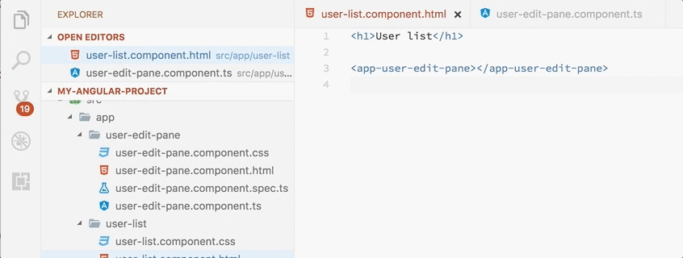

# Angular Follow Selector

This extension for Visual Studio code enables you to click on Angular selectors in HTML files and be redirected to their definition in the respective component.

## Demo

## Requirements

You need Visual Studio Code with a minimum version of 1.10 and, to be a useful extension, an Angular 2+ project that utilizes Typescript.

## Known Issues

None found so far but feel free to log an issue if you encounter something unexpected! 😊

## Release Notes

### 1.0.0

Initial release of Angular Follow Selector
